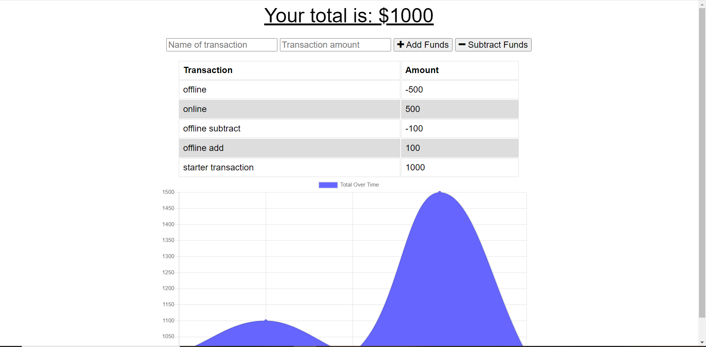

# Budget Tracker

This project is a simple way to keep track of spending habits. You can add and subtract any amount and a graph will be generated of your overall spending in an easy and readable format. The project comes with offline functionality as well where if you were to lose internet connection any additions or subtractions will be add to the budget once you come back online.

I worked on offline functionality while the rest of the code was provided.

[Link to the project](https://evening-garden-12940.herokuapp.com/)